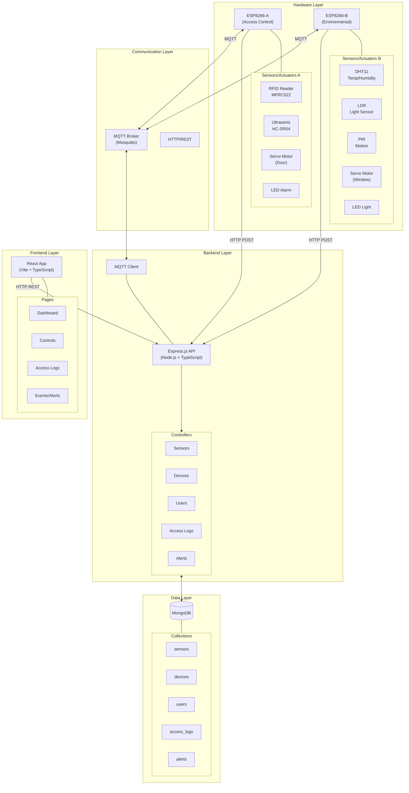
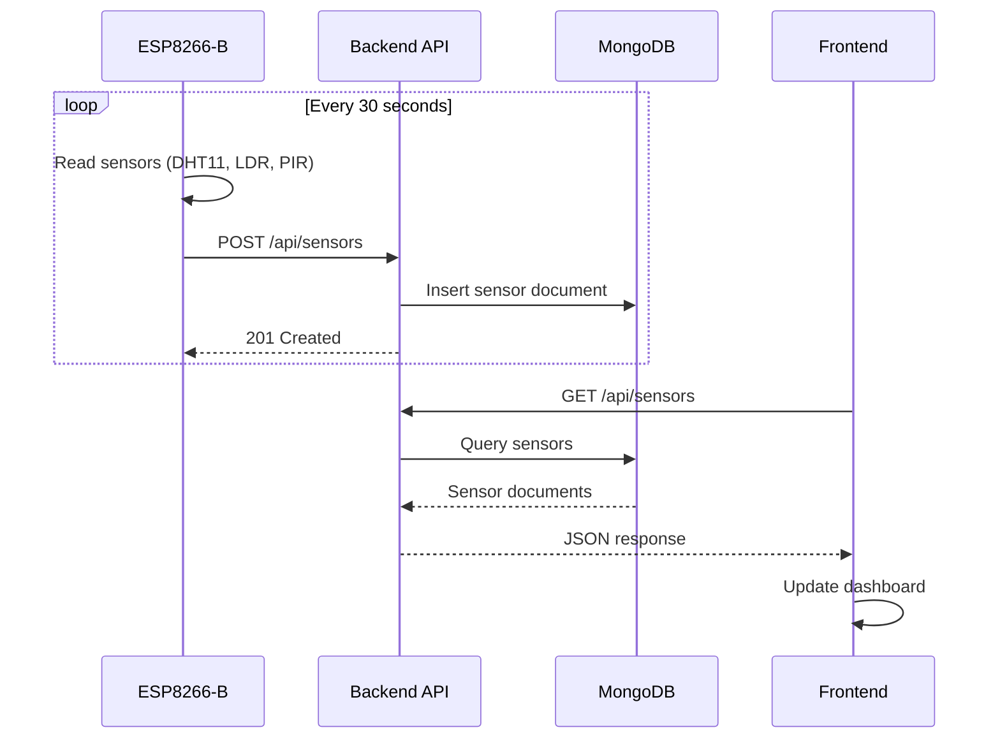
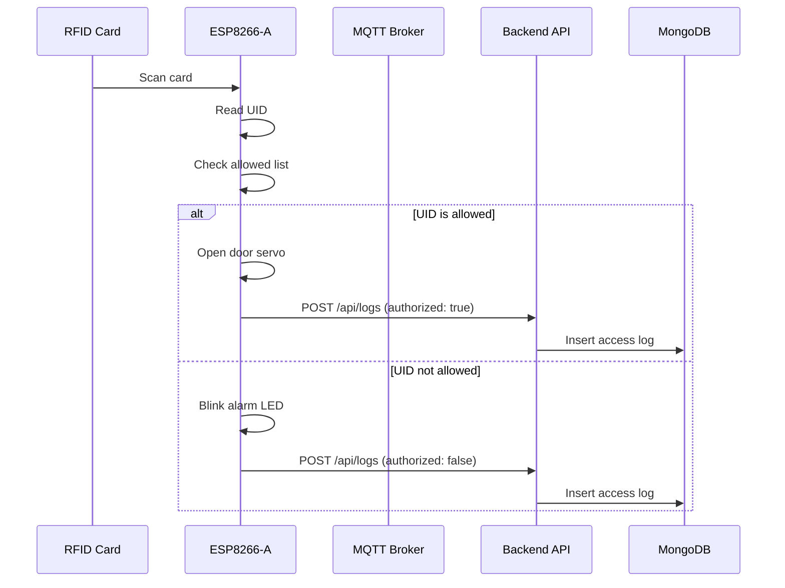
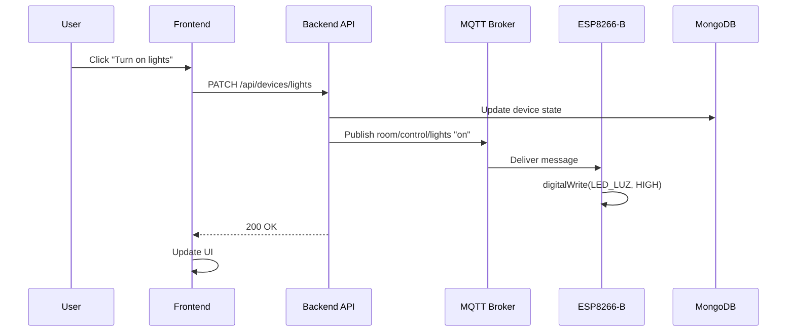

# SmartRoom Architecture

This document describes the system architecture of the SmartRoom IoT smart room automation system.

## System Overview

SmartRoom is a full-stack IoT solution that combines embedded systems, backend services, and a modern web frontend to create an intelligent room automation system.

## Architecture Diagram



## ASCII Architecture Diagram

For environments that don't render Mermaid diagrams:

```
┌─────────────────────────────────────────────────────────────────────────────────┐
│                              SMARTROOM ARCHITECTURE                              │
└─────────────────────────────────────────────────────────────────────────────────┘

┌─────────────────────────────────────────────────────────────────────────────────┐
│                              HARDWARE LAYER                                      │
│  ┌─────────────────────────────┐    ┌─────────────────────────────┐            │
│  │      ESP8266-A (Access)      │    │   ESP8266-B (Environmental)  │            │
│  │  ┌─────────────────────────┐ │    │  ┌─────────────────────────┐ │            │
│  │  │ • RFID Reader (MFRC522) │ │    │  │ • DHT11 (Temp/Humidity) │ │            │
│  │  │ • Ultrasonic (HC-SR04)  │ │    │  │ • LDR (Light Sensor)    │ │            │
│  │  │ • Servo Motor (Door)    │ │    │  │ • PIR (Motion Sensor)   │ │            │
│  │  │ • LED Alarm             │ │    │  │ • Servo Motor (Window)  │ │            │
│  │  └─────────────────────────┘ │    │  │ • LED Light             │ │            │
│  └──────────────┬──────────────┘    └──────────────┬──────────────┘            │
└─────────────────┼──────────────────────────────────┼────────────────────────────┘
                  │                                  │
                  │  WiFi (HTTP POST / MQTT)         │  WiFi (HTTP POST / MQTT)
                  │                                  │
┌─────────────────┼──────────────────────────────────┼────────────────────────────┐
│                 ▼                                  ▼     COMMUNICATION LAYER     │
│  ┌──────────────────────────────────────────────────────────────────────────┐  │
│  │                         MQTT BROKER (Mosquitto)                           │  │
│  │           Topics: rfid/allowed/update, room/control/*                     │  │
│  └────────────────────────────────────┬─────────────────────────────────────┘  │
└───────────────────────────────────────┼─────────────────────────────────────────┘
                                        │
                                        │ MQTT Subscribe/Publish
                                        │
┌───────────────────────────────────────┼─────────────────────────────────────────┐
│                                       ▼              BACKEND LAYER              │
│  ┌──────────────────────────────────────────────────────────────────────────┐  │
│  │                    EXPRESS.JS API (Node.js + TypeScript)                  │  │
│  │                                                                           │  │
│  │   ┌────────────────────────────────────────────────────────────────────┐ │  │
│  │   │                          ROUTES                                    │ │  │
│  │   │  /api/sensors  /api/devices  /api/users  /api/logs  /api/alerts   │ │  │
│  │   └────────────────────────────────────────────────────────────────────┘ │  │
│  │                                                                           │  │
│  │   ┌────────────────────────────────────────────────────────────────────┐ │  │
│  │   │                       CONTROLLERS                                   │ │  │
│  │   │  SensorController | DeviceController | UserController | ...        │ │  │
│  │   └────────────────────────────────────────────────────────────────────┘ │  │
│  │                                                                           │  │
│  │   ┌────────────────────────────────────────────────────────────────────┐ │  │
│  │   │                         SERVICES                                    │ │  │
│  │   │  UserService | MQTT Client                                         │ │  │
│  │   └────────────────────────────────────────────────────────────────────┘ │  │
│  └──────────────────────────────────────┬───────────────────────────────────┘  │
└─────────────────────────────────────────┼───────────────────────────────────────┘
                                          │
                                          │ Mongoose ODM
                                          │
┌─────────────────────────────────────────┼───────────────────────────────────────┐
│                                         ▼                   DATA LAYER          │
│  ┌──────────────────────────────────────────────────────────────────────────┐  │
│  │                              MONGODB                                      │  │
│  │                                                                           │  │
│  │   ┌──────────┐ ┌──────────┐ ┌──────────┐ ┌──────────┐ ┌──────────┐      │  │
│  │   │ sensors  │ │ devices  │ │  users   │ │access_   │ │  alerts  │      │  │
│  │   │          │ │          │ │          │ │  logs    │ │          │      │  │
│  │   └──────────┘ └──────────┘ └──────────┘ └──────────┘ └──────────┘      │  │
│  └──────────────────────────────────────────────────────────────────────────┘  │
└─────────────────────────────────────────────────────────────────────────────────┘
                                          ▲
                                          │ HTTP REST API
                                          │
┌─────────────────────────────────────────┼───────────────────────────────────────┐
│                                         │                FRONTEND LAYER         │
│  ┌──────────────────────────────────────────────────────────────────────────┐  │
│  │                   REACT APPLICATION (Vite + TypeScript)                   │  │
│  │                                                                           │  │
│  │   ┌──────────────────────────────────────────────────────────────────┐   │  │
│  │   │                           PAGES                                   │   │  │
│  │   │   ┌──────────┐ ┌──────────┐ ┌──────────┐ ┌──────────┐           │   │  │
│  │   │   │Dashboard │ │ Controls │ │  Access  │ │  Events  │           │   │  │
│  │   │   └──────────┘ └──────────┘ └──────────┘ └──────────┘           │   │  │
│  │   └──────────────────────────────────────────────────────────────────┘   │  │
│  │                                                                           │  │
│  │   ┌──────────────────────────────────────────────────────────────────┐   │  │
│  │   │                       TECH STACK                                  │   │  │
│  │   │   React 19 | React Router | Tailwind CSS | Recharts | Lucide    │   │  │
│  │   └──────────────────────────────────────────────────────────────────┘   │  │
│  └──────────────────────────────────────────────────────────────────────────┘  │
└─────────────────────────────────────────────────────────────────────────────────┘
```

## Component Descriptions

### Hardware Layer

#### ESP8266-A (Access Control Node)

**Purpose**: Manages physical access to the room through RFID-based authentication.

**Components**:
- **MFRC522 RFID Reader**: Reads RFID card UIDs for authentication
- **HC-SR04 Ultrasonic Sensor**: Detects presence near the door
- **SG90 Servo Motor**: Controls door lock mechanism
- **LED Alarm**: Visual indicator for unauthorized access attempts

**Responsibilities**:
- Read and validate RFID cards
- Control door servo based on authentication
- Detect prolonged presence without valid RFID
- Generate security alerts
- Log access attempts to backend

#### ESP8266-B (Environmental Control Node)

**Purpose**: Monitors environmental conditions and controls room comfort systems.

**Components**:
- **DHT11**: Temperature and humidity sensor
- **LDR (Photoresistor)**: Light level sensor
- **HC-SR501 PIR**: Motion detection sensor
- **SG90 Servo Motor**: Controls window mechanism
- **LED**: Room lighting control

**Responsibilities**:
- Monitor temperature, humidity, and light levels
- Detect motion in the room
- Automatic window control based on temperature
- Automatic light control based on ambient light
- Support manual override via MQTT commands
- Send sensor readings to backend

### Communication Layer

#### MQTT Broker (Mosquitto)

**Purpose**: Enables real-time bidirectional communication between backend and ESP8266 devices.

**Topics**:
| Topic | Publisher | Subscriber | Payload |
|-------|-----------|------------|---------|
| `rfid/allowed/update` | Backend | ESP8266-A | JSON array of allowed UIDs |
| `room/control/lights` | Backend | ESP8266-B | `"on"` / `"off"` |
| `room/control/window` | Backend | ESP8266-B | `"open"` / `"closed"` |
| `room/control/door` | Backend | ESP8266-A | `"open"` / `"closed"` / `"locked"` |
| `room/control/manual` | Backend | ESP8266-B | `true` / `false` |

#### HTTP/REST

**Purpose**: Primary communication method for sensor data and API requests.

**Endpoints**: ESP8266 devices POST sensor data and logs to backend REST API.

### Backend Layer

#### Express.js API Server

**Purpose**: Central hub for data processing, storage, and device coordination.

**Structure**:
```
backend/src/
├── app.ts              # Express app configuration
├── server.ts           # Server entry point
├── config/
│   ├── config.ts       # Environment configuration
│   └── response.ts     # Response utilities
├── controllers/
│   ├── sensors_controller.ts
│   ├── devices_controller.ts
│   ├── user_controller.ts
│   ├── acess_logs_controller.ts
│   └── alerts_controller.ts
├── models/
│   ├── sensors_model.ts
│   ├── device_model.ts
│   ├── user_model.ts
│   ├── access_logs_model.ts
│   └── alerts_model.ts
├── routes/
│   ├── index.ts
│   ├── sensors_routes.ts
│   ├── devices_routes.ts
│   ├── user_routes.ts
│   ├── access_logs_routes.ts
│   └── alert_routes.ts
├── services/
│   └── user_service.ts
└── mqtt/
    └── mqtt_client.ts
```

**Responsibilities**:
- Expose REST API for CRUD operations
- Validate and process incoming data
- Store data in MongoDB
- Publish MQTT messages for device control
- Synchronize allowed RFID UIDs to devices

### Data Layer

#### MongoDB

**Purpose**: Persistent storage for all application data.

**Collections**:

| Collection | Description |
|------------|-------------|
| `sensors` | Time-series sensor readings |
| `devices` | Current state of controllable devices |
| `users` | User accounts with RFID associations |
| `access_logs` | Historical record of access attempts |
| `alerts` | Security and environmental alerts |

**Relationships**:
- `access_logs.user_id` → `users._id` (optional reference)
- All collections have `source` field for device identification

### Frontend Layer

#### React Application

**Purpose**: User interface for monitoring and control.

**Structure**:
```
frontend/src/
├── App.tsx             # Root component
├── main.tsx            # Entry point
├── api/
│   ├── sensorsApi.ts
│   ├── controlsApi.ts
│   ├── usersApi.ts
│   ├── logsApi.ts
│   └── alertsApi.ts
├── components/         # Reusable UI components
├── hooks/              # Custom React hooks
├── layouts/            # Page layouts
├── pages/
│   ├── Dashboard.tsx   # Sensor overview
│   ├── Controls.tsx    # Device controls
│   ├── Access.tsx      # Access logs
│   └── Events.tsx      # Alerts and events
└── types/
    ├── Sensors.ts
    ├── User.ts
    ├── Logs.ts
    └── Alerts.ts
```

**Pages**:
- **Dashboard**: Real-time sensor data display with charts
- **Controls**: Manual device control interface
- **Access**: Access log viewer with user details
- **Events**: Alert management and history

## Data Flow Diagrams

### Sensor Data Flow



### Access Control Flow



### Device Control Flow



## Security Architecture

```
┌─────────────────────────────────────────────────────────────────────────────────┐
│                           SECURITY BOUNDARIES                                    │
├─────────────────────────────────────────────────────────────────────────────────┤
│                                                                                 │
│   ┌───────────────────────────────────────────────────────────────────────┐    │
│   │                        INTERNET BOUNDARY                               │    │
│   │   [Future: TLS/HTTPS, JWT Authentication, Rate Limiting]              │    │
│   └───────────────────────────────────────────────────────────────────────┘    │
│                                       │                                         │
│   ┌───────────────────────────────────┼───────────────────────────────────┐    │
│   │                         DMZ / APPLICATION ZONE                         │    │
│   │                                   │                                    │    │
│   │        ┌──────────────────────────┴──────────────────────────┐        │    │
│   │        │                   NGINX REVERSE PROXY                │        │    │
│   │        │              (TLS termination, static files)         │        │    │
│   │        └──────────────────────────┬──────────────────────────┘        │    │
│   │                                   │                                    │    │
│   │        ┌──────────────────────────┴──────────────────────────┐        │    │
│   │        │                    BACKEND API                       │        │    │
│   │        │            (Input validation, CORS)                  │        │    │
│   │        └──────────────────────────┬──────────────────────────┘        │    │
│   └───────────────────────────────────┼───────────────────────────────────┘    │
│                                       │                                         │
│   ┌───────────────────────────────────┼───────────────────────────────────┐    │
│   │                          DATABASE ZONE                                 │    │
│   │                                   │                                    │    │
│   │        ┌──────────────────────────┴──────────────────────────┐        │    │
│   │        │                     MONGODB                          │        │    │
│   │        │           (Authentication, network binding)          │        │    │
│   │        └─────────────────────────────────────────────────────┘        │    │
│   └───────────────────────────────────────────────────────────────────────┘    │
│                                                                                 │
│   ┌───────────────────────────────────────────────────────────────────────┐    │
│   │                           IOT ZONE (VLAN)                              │    │
│   │                                                                        │    │
│   │   ┌─────────────────┐         ┌─────────────────────────────────┐     │    │
│   │   │   MQTT BROKER   │◄───────►│        ESP8266 DEVICES          │     │    │
│   │   │ (Auth required) │         │   (WiFi WPA2, local network)    │     │    │
│   │   └─────────────────┘         └─────────────────────────────────┘     │    │
│   └───────────────────────────────────────────────────────────────────────┘    │
│                                                                                 │
└─────────────────────────────────────────────────────────────────────────────────┘
```

## Scalability Considerations

### Current Architecture Limitations

1. **Single MongoDB instance**: No replication or sharding
2. **Single backend instance**: No load balancing
3. **Polling-based frontend**: No real-time updates via WebSocket
4. **Hardcoded device configuration**: Limited to predefined ESP8266 nodes

### Future Scalability Options

1. **Database**: MongoDB replica set for high availability
2. **Backend**: Multiple API instances behind load balancer
3. **Real-time**: Add WebSocket or Server-Sent Events for live updates
4. **Device management**: Dynamic device registration and discovery
5. **Microservices**: Split into sensor, access, and control services

---

## Related Documentation

- [Technical Documentation](./TECHNICAL.md) - Detailed technical information
- [Setup Guide](./SETUP.md) - Development environment setup
- [API Reference](./API.md) - REST API documentation
- [Contributing](./CONTRIBUTING.md) - How to contribute

---

*Last updated: December 2024*
