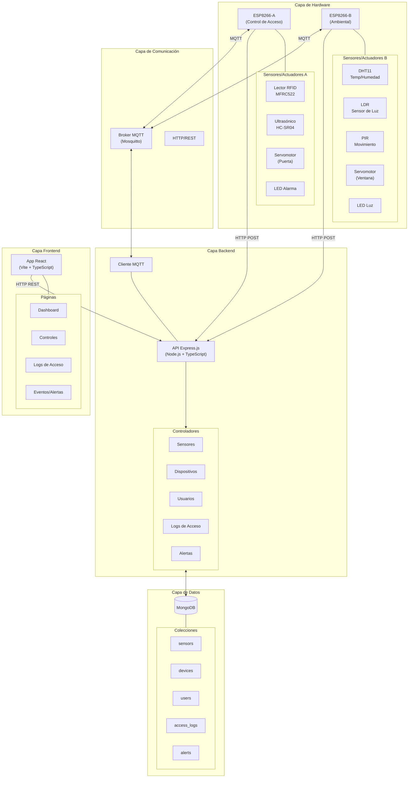
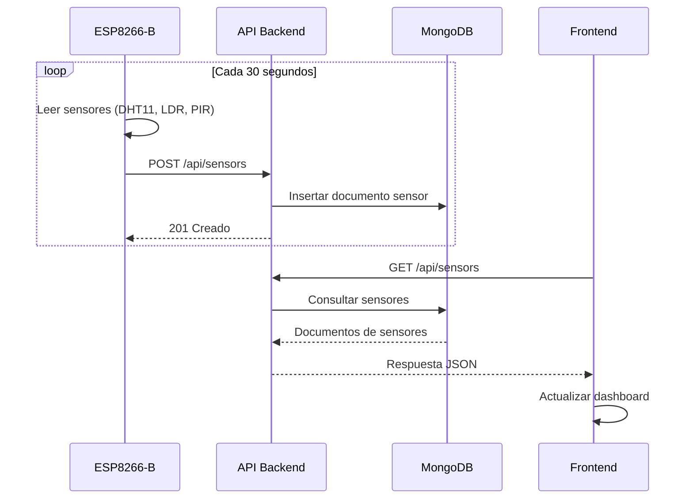
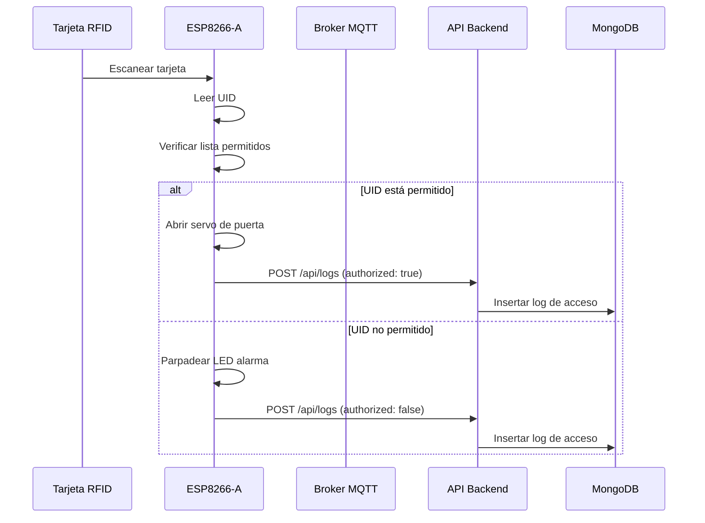
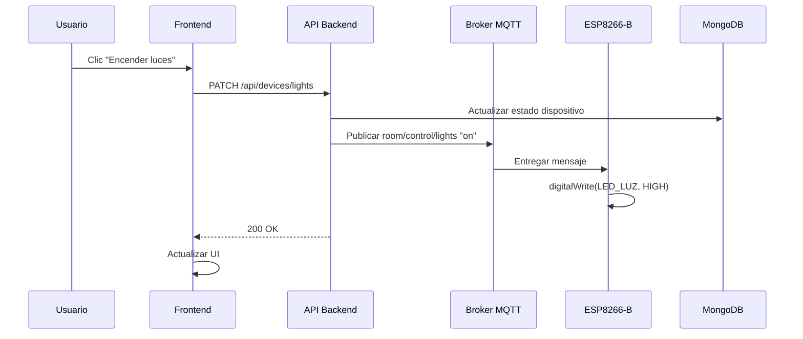

# Arquitectura de SmartRoom

Este documento describe la arquitectura del sistema SmartRoom de automatización de habitaciones inteligentes basado en IoT.

## Visión General del Sistema

SmartRoom es una solución IoT full-stack que combina sistemas embebidos, servicios backend y un frontend web moderno para crear un sistema inteligente de automatización de habitaciones.

## Diagrama de Arquitectura



## Diagrama de Arquitectura ASCII

Para entornos que no renderizan diagramas Mermaid:

```
┌─────────────────────────────────────────────────────────────────────────────────┐
│                           ARQUITECTURA SMARTROOM                                 │
└─────────────────────────────────────────────────────────────────────────────────┘

┌─────────────────────────────────────────────────────────────────────────────────┐
│                              CAPA DE HARDWARE                                    │
│  ┌─────────────────────────────┐    ┌─────────────────────────────┐            │
│  │      ESP8266-A (Acceso)      │    │   ESP8266-B (Ambiental)      │            │
│  │  ┌─────────────────────────┐ │    │  ┌─────────────────────────┐ │            │
│  │  │ • Lector RFID (MFRC522) │ │    │  │ • DHT11 (Temp/Humedad)  │ │            │
│  │  │ • Ultrasónico (HC-SR04) │ │    │  │ • LDR (Sensor de Luz)   │ │            │
│  │  │ • Servomotor (Puerta)   │ │    │  │ • PIR (Sensor Movim.)   │ │            │
│  │  │ • LED Alarma            │ │    │  │ • Servomotor (Ventana)  │ │            │
│  │  └─────────────────────────┘ │    │  │ • LED Luz               │ │            │
│  └──────────────┬──────────────┘    └──────────────┬──────────────┘            │
└─────────────────┼──────────────────────────────────┼────────────────────────────┘
                  │                                  │
                  │  WiFi (HTTP POST / MQTT)         │  WiFi (HTTP POST / MQTT)
                  │                                  │
┌─────────────────┼──────────────────────────────────┼────────────────────────────┐
│                 ▼                                  ▼     CAPA DE COMUNICACIÓN    │
│  ┌──────────────────────────────────────────────────────────────────────────┐  │
│  │                       BROKER MQTT (Mosquitto)                             │  │
│  │           Topics: rfid/allowed/update, room/control/*                     │  │
│  └────────────────────────────────────┬─────────────────────────────────────┘  │
└───────────────────────────────────────┼─────────────────────────────────────────┘
                                        │
                                        │ MQTT Subscribe/Publish
                                        │
┌───────────────────────────────────────┼─────────────────────────────────────────┐
│                                       ▼                    CAPA BACKEND         │
│  ┌──────────────────────────────────────────────────────────────────────────┐  │
│  │                    API EXPRESS.JS (Node.js + TypeScript)                  │  │
│  │                                                                           │  │
│  │   ┌────────────────────────────────────────────────────────────────────┐ │  │
│  │   │                           RUTAS                                    │ │  │
│  │   │  /api/sensors  /api/devices  /api/users  /api/logs  /api/alerts   │ │  │
│  │   └────────────────────────────────────────────────────────────────────┘ │  │
│  │                                                                           │  │
│  │   ┌────────────────────────────────────────────────────────────────────┐ │  │
│  │   │                       CONTROLADORES                                 │ │  │
│  │   │  SensorController | DeviceController | UserController | ...        │ │  │
│  │   └────────────────────────────────────────────────────────────────────┘ │  │
│  │                                                                           │  │
│  │   ┌────────────────────────────────────────────────────────────────────┐ │  │
│  │   │                         SERVICIOS                                   │ │  │
│  │   │  UserService | Cliente MQTT                                        │ │  │
│  │   └────────────────────────────────────────────────────────────────────┘ │  │
│  └──────────────────────────────────────┬───────────────────────────────────┘  │
└─────────────────────────────────────────┼───────────────────────────────────────┘
                                          │
                                          │ Mongoose ODM
                                          │
┌─────────────────────────────────────────┼───────────────────────────────────────┐
│                                         ▼                   CAPA DE DATOS       │
│  ┌──────────────────────────────────────────────────────────────────────────┐  │
│  │                              MONGODB                                      │  │
│  │                                                                           │  │
│  │   ┌──────────┐ ┌──────────┐ ┌──────────┐ ┌──────────┐ ┌──────────┐      │  │
│  │   │ sensors  │ │ devices  │ │  users   │ │access_   │ │  alerts  │      │  │
│  │   │          │ │          │ │          │ │  logs    │ │          │      │  │
│  │   └──────────┘ └──────────┘ └──────────┘ └──────────┘ └──────────┘      │  │
│  └──────────────────────────────────────────────────────────────────────────┘  │
└─────────────────────────────────────────────────────────────────────────────────┘
                                          ▲
                                          │ API HTTP REST
                                          │
┌─────────────────────────────────────────┼───────────────────────────────────────┐
│                                         │                  CAPA FRONTEND        │
│  ┌──────────────────────────────────────────────────────────────────────────┐  │
│  │                   APLICACIÓN REACT (Vite + TypeScript)                    │  │
│  │                                                                           │  │
│  │   ┌──────────────────────────────────────────────────────────────────┐   │  │
│  │   │                           PÁGINAS                                 │   │  │
│  │   │   ┌──────────┐ ┌──────────┐ ┌──────────┐ ┌──────────┐           │   │  │
│  │   │   │Dashboard │ │Controles │ │  Acceso  │ │ Eventos  │           │   │  │
│  │   │   └──────────┘ └──────────┘ └──────────┘ └──────────┘           │   │  │
│  │   └──────────────────────────────────────────────────────────────────┘   │  │
│  │                                                                           │  │
│  │   ┌──────────────────────────────────────────────────────────────────┐   │  │
│  │   │                       STACK TECNOLÓGICO                           │   │  │
│  │   │   React 19 | React Router | Tailwind CSS | Recharts | Lucide    │   │  │
│  │   └──────────────────────────────────────────────────────────────────┘   │  │
│  └──────────────────────────────────────────────────────────────────────────┘  │
└─────────────────────────────────────────────────────────────────────────────────┘
```

## Descripción de Componentes

### Capa de Hardware

#### ESP8266-A (Nodo de Control de Acceso)

**Propósito**: Gestiona el acceso físico a la habitación mediante autenticación basada en RFID.

**Componentes**:
- **Lector RFID MFRC522**: Lee UIDs de tarjetas RFID para autenticación
- **Sensor Ultrasónico HC-SR04**: Detecta presencia cerca de la puerta
- **Servomotor SG90**: Controla el mecanismo de cerradura de la puerta
- **LED Alarma**: Indicador visual para intentos de acceso no autorizados

**Responsabilidades**:
- Leer y validar tarjetas RFID
- Controlar servo de puerta basado en autenticación
- Detectar presencia prolongada sin RFID válido
- Generar alertas de seguridad
- Registrar intentos de acceso en el backend

#### ESP8266-B (Nodo de Control Ambiental)

**Propósito**: Monitorea condiciones ambientales y controla sistemas de confort de la habitación.

**Componentes**:
- **DHT11**: Sensor de temperatura y humedad
- **LDR (Fotorresistor)**: Sensor de nivel de luz
- **HC-SR501 PIR**: Sensor de detección de movimiento
- **Servomotor SG90**: Controla mecanismo de ventana
- **LED**: Control de iluminación de la habitación

**Responsabilidades**:
- Monitorear temperatura, humedad y niveles de luz
- Detectar movimiento en la habitación
- Control automático de ventana basado en temperatura
- Control automático de luz basado en luz ambiental
- Soportar modo manual vía comandos MQTT
- Enviar lecturas de sensores al backend

### Capa de Comunicación

#### Broker MQTT (Mosquitto)

**Propósito**: Habilita comunicación bidireccional en tiempo real entre backend y dispositivos ESP8266.

**Topics**:
| Topic | Publicador | Suscriptor | Payload |
|-------|------------|------------|---------|
| `rfid/allowed/update` | Backend | ESP8266-A | Array JSON de UIDs permitidos |
| `room/control/lights` | Backend | ESP8266-B | `"on"` / `"off"` |
| `room/control/window` | Backend | ESP8266-B | `"open"` / `"closed"` |
| `room/control/door` | Backend | ESP8266-A | `"open"` / `"closed"` / `"locked"` |
| `room/control/manual` | Backend | ESP8266-B | `true` / `false` |

#### HTTP/REST

**Propósito**: Método de comunicación principal para datos de sensores y peticiones a la API.

**Endpoints**: Dispositivos ESP8266 envían POST de datos de sensores y logs a la API REST del backend.

### Capa Backend

#### Servidor API Express.js

**Propósito**: Hub central para procesamiento de datos, almacenamiento y coordinación de dispositivos.

**Estructura**:
```
backend/src/
├── app.ts              # Configuración de la app Express
├── server.ts           # Punto de entrada del servidor
├── config/
│   ├── config.ts       # Configuración de entorno
│   └── response.ts     # Utilidades de respuesta
├── controllers/
│   ├── sensors_controller.ts
│   ├── devices_controller.ts
│   ├── user_controller.ts
│   ├── acess_logs_controller.ts
│   └── alerts_controller.ts
├── models/
│   ├── sensors_model.ts
│   ├── device_model.ts
│   ├── user_model.ts
│   ├── access_logs_model.ts
│   └── alerts_model.ts
├── routes/
│   ├── index.ts
│   ├── sensors_routes.ts
│   ├── devices_routes.ts
│   ├── user_routes.ts
│   ├── access_logs_routes.ts
│   └── alert_routes.ts
├── services/
│   └── user_service.ts
└── mqtt/
    └── mqtt_client.ts
```

**Responsabilidades**:
- Exponer API REST para operaciones CRUD
- Validar y procesar datos entrantes
- Almacenar datos en MongoDB
- Publicar mensajes MQTT para control de dispositivos
- Sincronizar UIDs RFID permitidos a dispositivos

### Capa de Datos

#### MongoDB

**Propósito**: Almacenamiento persistente para todos los datos de la aplicación.

**Colecciones**:

| Colección | Descripción |
|-----------|-------------|
| `sensors` | Lecturas de sensores en series de tiempo |
| `devices` | Estado actual de dispositivos controlables |
| `users` | Cuentas de usuario con asociaciones RFID |
| `access_logs` | Registro histórico de intentos de acceso |
| `alerts` | Alertas de seguridad y ambientales |

**Relaciones**:
- `access_logs.user_id` → `users._id` (referencia opcional)
- Todas las colecciones tienen campo `source` para identificación de dispositivo

### Capa Frontend

#### Aplicación React

**Propósito**: Interfaz de usuario para monitoreo y control.

**Estructura**:
```
frontend/src/
├── App.tsx             # Componente raíz
├── main.tsx            # Punto de entrada
├── api/
│   ├── sensorsApi.ts
│   ├── controlsApi.ts
│   ├── usersApi.ts
│   ├── logsApi.ts
│   └── alertsApi.ts
├── components/
│   ├── Clock.tsx           # Componente de reloj
│   ├── ControlPanel.tsx    # Panel de control de dispositivos
│   ├── ControlSwitch.tsx   # Componente switch genérico
│   ├── DoorSwitch.tsx      # Switch de control de puerta
│   ├── LightSwitch.tsx     # Switch de control de luz
│   ├── ManualSwitch.tsx    # Toggle modo Manual/Auto
│   └── WindowSwitch.tsx    # Switch de control de ventana
├── hooks/
│   └── useFetch.ts         # Hook de obtención de datos
├── layouts/
│   └── Layout.tsx          # Wrapper de layout principal
├── pages/
│   ├── Dashboard.tsx   # Vista general de sensores
│   ├── Controls.tsx    # Controles de dispositivos
│   ├── Access.tsx      # Logs de acceso
│   └── Events.tsx      # Alertas y eventos
└── types/
    ├── Sensors.ts
    ├── User.ts
    ├── Logs.ts
    └── Alerts.ts
```

**Páginas**:
- **Dashboard**: Visualización de datos de sensores en tiempo real con gráficos
- **Controles**: Interfaz de control manual de dispositivos
- **Acceso**: Visor de logs de acceso con detalles de usuario
- **Eventos**: Gestión e historial de alertas

## Diagramas de Flujo de Datos

### Flujo de Datos de Sensores



### Flujo de Control de Acceso



### Flujo de Control de Dispositivos



## Consideraciones de Escalabilidad

### Limitaciones de la Arquitectura Actual

1. **Instancia única de MongoDB**: Sin replicación ni sharding
2. **Instancia única de backend**: Sin balanceo de carga
3. **Frontend basado en polling**: Sin actualizaciones en tiempo real vía WebSocket
4. **Configuración de dispositivos hardcodeada**: Limitado a nodos ESP8266 predefinidos

### Opciones de Escalabilidad Futura

1. **Base de datos**: Replica set de MongoDB para alta disponibilidad
2. **Backend**: Múltiples instancias de API detrás de balanceador de carga
3. **Tiempo real**: Agregar WebSocket o Server-Sent Events para actualizaciones en vivo
4. **Gestión de dispositivos**: Registro y descubrimiento dinámico de dispositivos
5. **Microservicios**: Dividir en servicios de sensores, acceso y control

---

## Documentación Relacionada

- [Documentación Técnica](./TECHNICAL.md) - Información técnica detallada
- [Guía de Configuración](./SETUP.md) - Configuración del entorno de desarrollo
- [Referencia de API](./API.md) - Documentación de API REST
- [Contribución](./CONTRIBUTING.md) - Cómo contribuir

---

*Última actualización: Diciembre 2024*
